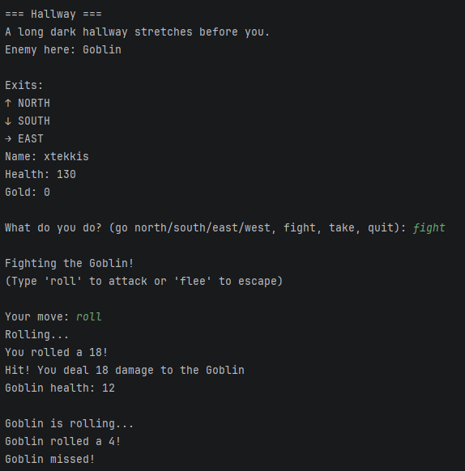

# Text RPG

A text-based dungeon RPG built with Java. Navigate through rooms, fight enemies
using a dice roll combat system and defeat the final boss to win.

## Preview

## How to Play

Run the game, enter your username and use the following commands to play:

| Command | Description |
|---|---|
| go north/south/east/west | Move between rooms |
| fight | Enter combat with an enemy |
| take | Pick up an item in the room |
| quit | Exit the game |

During combat:

| Command | Description |
|---|---|
| roll | Roll a 20 sided dice to attack |
| flee | Escape the fight at the cost of 10 HP (not available against the boss) |

## Combat System

Each turn both the player and the enemy roll a 20 sided dice. A roll of 10 or
above lands a hit. The damage dealt equals the number rolled. A roll below 10
is a miss.

## World

| Location | Description |
|---|---|
| Entrance | Starting area, contains a Health Potion |
| Hallway | A Goblin guards the path north |
| Treasury | Contains an Elixir |
| Boss Chamber | The Dark Knight awaits |

## Built With

- Java 21

## How to Run

1. Clone the repository
   git clone https://github.com/xtekkis/text-rpg.git
2. Open in IntelliJ IDEA
3. Run Main.java